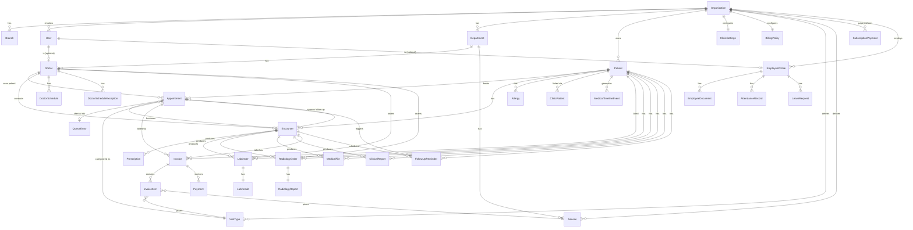

# Database Schema

> Source: `apps/api/prisma/schema.prisma` (1360 lines, read in full for this document — accurate as of commit `13890c4`). PostgreSQL via Prisma. All models use `cuid()` string primary keys unless noted.

## 1. Conventions Observed in the Schema

- **Soft delete by default**: most models have `deletedAt DateTime?`. Confirmed exceptions (no `deletedAt`, i.e. hard-delete or append-only): `QueueEntry` (has `deletedAt` actually — see below), `LabResult`, `RadiologyReport`, `InvoiceItem`, `Payment`, `AuditLog`, `DoctorSchedule`, `DoctorScheduleException`, `ClinicWorkingDay`, `AttendanceRecord`, `LeaveRequest`. (Re-checked directly against schema text in this pass; `QueueEntry` *does* have `deletedAt`/`deletedBy`.)
- **Multi-tenancy**: `organizationId String` present (directly or via parent) on nearly every domain model, indexed.
- **Decimal money fields**: `@db.Decimal(10, 2)` throughout billing/HR salary fields; Prisma returns these as `string` in JSON (must `.toNumber()` before arithmetic — noted in project conventions).
- **Bilingual fields**: many models carry an `Ar`-suffixed twin column (`nameAr`, `firstNameAr`, etc.) for Arabic alongside the Latin-script field.
- **Named relations**: used wherever a model has more than one FK to the same target table (e.g. `User` has `createdInvoices` vs `receivedPayments` vs `voidedPayments`, all pointing at different relations to `Invoice`/`Payment`).

## 2. Entity-Relationship Diagram (core clinical + billing)

## 3. Enums

| Enum | Values |
|---|---|
| `UserRole` | SUPER_ADMIN, ORG_ADMIN, BRANCH_ADMIN, DOCTOR, NURSE, SECRETARY, ACCOUNTANT, TECHNICIAN |
| `Gender` | MALE, FEMALE |
| `OrganizationType` | HOSPITAL, CLINIC, POLYCLINIC |
| `SubscriptionStatus` | TRIAL, ACTIVE, SUSPENDED, EXPIRED, CANCELLED |
| `SubscriptionPaymentMethod` | CASH, BANK_TRANSFER, CARD, CHEQUE, ONLINE, OTHER |
| `AppointmentStatus` | SCHEDULED, CONFIRMED, CHECKED_IN, IN_QUEUE, IN_PROGRESS, COMPLETED, CANCELLED, NO_SHOW |
| `AllergySeverity` | MILD, MODERATE, SEVERE |
| `QueueStatus` | WAITING, CALLED, IN_PROGRESS, DONE, SKIPPED |
| `MedicalTimelineEventType` | PATIENT_CREATED, PATIENT_UPDATED, PATIENT_ARCHIVED, APPOINTMENT_BOOKED, FOLLOW_UP_BOOKED, CHECKED_IN, QUEUE_JOINED, ENCOUNTER_STARTED, ENCOUNTER_COMPLETED, PRESCRIPTION_ADDED, LAB_ORDERED, LAB_RESULT_ADDED, RADIOLOGY_ORDERED, RADIOLOGY_REPORT_ADDED, LAB_RESULT_REVIEWED, RADIOLOGY_REPORT_REVIEWED, MEDICAL_FILE_UPLOADED, CLINICAL_REPORT_CREATED |
| `LabOrderStatus` | ORDERED, SAMPLE_COLLECTED, IN_PROGRESS, RESULTED, REVIEWED, CANCELLED |
| `RadiologyOrderStatus` | ORDERED, SCHEDULED, IN_PROGRESS, RESULTED, REVIEWED, CANCELLED |
| `ClinicalReportStatus` | DRAFT, FINALIZED |
| `VisitTypeCode` | CONSULTATION, FOLLOW_UP, EMERGENCY, PROCEDURE, FREE_VISIT |
| `ScheduleExceptionType` | HOLIDAY, LEAVE, CUSTOM_HOURS |
| `ReminderChannel` | IN_APP, SMS, WHATSAPP, EMAIL |
| `ReminderStatus` | PENDING, SENT, FAILED, CANCELLED |
| `PatientResponseStatus` | CONFIRMED, NO_RESPONSE, DECLINED, RESCHEDULE_REQUESTED |
| `ClinicPatientStatus` | ACTIVE, PENDING_VERIFICATION, SUSPENDED, REVOKED |
| `ClinicPatientLinkType` | CLINIC_CREATED, PATIENT_VERIFIED, IMPORTED, INVITED |
| `EmploymentStatus` | ACTIVE, ON_LEAVE, TERMINATED |
| `EmployeeDocumentCategory` | PHOTO, ID_DOCUMENT, CONTRACT, CERTIFICATE, OTHER |
| `AttendanceStatus` | PRESENT, ABSENT, LATE, HALF_DAY, ON_LEAVE, HOLIDAY |
| `LeaveType` | ANNUAL, SICK, UNPAID, MATERNITY, OTHER |
| `LeaveStatus` | PENDING, APPROVED, REJECTED, CANCELLED |
| `InvoiceStatus` | DRAFT, ISSUED, PARTIALLY_PAID, PAID, CANCELLED |
| `PaymentMethod` | CASH, CARD, BANK_TRANSFER, INSURANCE, OTHER |
| `MedicalFileCategory` | LAB_RESULT, RADIOLOGY_IMAGE, PRESCRIPTION, REFERRAL, DISCHARGE_SUMMARY, CONSENT_FORM, INSURANCE, CLINICAL_NOTE, CLINICAL_REPORT, ID_DOCUMENT, OTHER |

## 4. Models by Domain

### Organizations & Branches
- **`Organization`** — tenant root. `type` (HOSPITAL/CLINIC/POLYCLINIC), `settings Json`, full subscription block (`subscriptionStatus/Plan/StartAt/EndAt/Notes`), soft delete. Has 19 relation arrays fanning out to nearly every other domain.
- **`Branch`** — optional sub-unit, `organizationId` FK, soft delete.

### Users & Auth
- **`User`** — `phone @unique` (login identifier), `email @unique` nullable, `passwordHash`, `role UserRole` (default SECRETARY), `branchId` optional, soft delete, `lastLoginAt`. Has 13 outgoing relations (doctor profile, audit logs, uploaded files, created invoices, received/voided payments, timeline events created, clinical reports created, clinic-patient links created, subscription payments created, employee profile, uploaded employee documents, attendance recorded, leave created/decided).

### Departments & Staff
- **`Department`** — org/branch-scoped, has Doctors, Services, EmployeeProfiles.
- **`Doctor`** — `userId @unique` (1:1 with User), `departmentId` optional, `consultationMinutes` (default 15), `maxPatientsPerDay` optional. No direct `organizationId` — tenant filter must go through `user.organizationId`.

### Employee / HR Profiles
- **`EmployeeProfile`** — `userId String? @unique` (optional+unique — HR-only employees may have no login; a User may have no profile). Carries its own name/contact/demographic fields (parallel to `Patient`'s pattern), `employmentStatus`, `baseSalary Decimal?`, `hireDate`/`contractStartAt`/`contractEndAt`.
- **`EmployeeDocument`** — `storageKey @unique`, category enum, `uploadedById → User`. Schema comment says "Foundation only — no upload endpoint yet" — **this comment is stale, audited and confirmed false as of 2026-06-21**: `employees-documents.controller.ts` implements a full presigned-URL upload flow (`upload-url`, register metadata, list, download-url, soft-delete). See [Architecture Audit Report.md](Architecture%20Audit%20Report.md) §6.
- **`AttendanceRecord`** — one row per `(employeeProfileId, date)` (`@@unique`), `organizationId` denormalized (must be server-derived from EmployeeProfile per schema comment), `status AttendanceStatus`, optional `checkInAt`/`checkOutAt`.
- **`LeaveRequest`** — linked to `EmployeeProfile` (not `User`), `organizationId` denormalized (same rule), `status LeaveStatus` default PENDING, `decidedById`/`decidedAt` optional, two named relations on `User` (`LeaveCreatedBy`, `LeaveDecidedBy`). Approval does **not** auto-update `EmployeeProfile.employmentStatus` (explicit schema comment).

### Patients
- **`Patient`** — `mrn` unique per `(organizationId, mrn)`, many optional demographic/contact fields with Arabic twins, `platformId String? @unique` + `hasPortalAccess Boolean` (groundwork for a patient-facing portal/platform identity — see Phase 126 in project history). 8 indexes including partial-match-friendly `(organizationId, firstName/lastName/phone/nationalId)`.
- **`MedicalTimelineEvent`** — append-only (no `updatedAt`/`deletedAt`), `eventType` enum, `metadata Json?`.
- **`Allergy`** — has `deletedAt` **and** `deletedBy` (unusual — most soft-deletes don't track who; suggests this needed an audit trail despite project history calling allergy delete "hard delete" — re-verify against current service code, this may have changed).
- **`ClinicPatient`** — the clinic-relationship layer introduced in Phase 126 to decouple platform patient identity from clinic-specific records. Unique on `(organizationId, patientId)` and `(organizationId, mrn)`. Carries verification-code fields (`verificationCodeHash`, `verificationExpiresAt`) for the cross-org link-request flow.

### Appointments & Queue
- **`Appointment`** — `sourceEncounterId` optional self-referencing-style FK to `Encounter` via the `"FollowUpAppointments"` named relation (an appointment can originate from a prior encounter's follow-up). `durationMin` default 15. Indexed on doctor, visitType, scheduledAt, patient, sourceEncounterId.
- **`QueueEntry`** — `appointmentId @unique` (1:1), `businessDate String` (YYYY-MM-DD, Asia/Damascus) for daily ticket reset, `@@unique([organizationId, businessDate, ticketNumber])`, `triageVitals Json?`, `chiefComplaintDraft String?` (added for nurse-triage prefill flow), has `deletedAt`/`deletedBy`.

### Encounters
- **`Encounter`** — `appointmentId String? @unique` (optional — walk-in encounters may have no appointment), `vitals Json?`, `followUpDate`, two-direction follow-up relation back to `Appointment` (`followUpAppointments`). Composite indexes for follow-up queries: `(organizationId, followUpDate)`, `(organizationId, doctorId, followUpDate)`.

### Prescriptions
- **`Prescription`** — scoped only by `encounterId` (no direct organizationId — tenant scoping flows through the encounter→patient chain). `refillsLeft Int @default(0)`.

### Labs & Radiology
- **`LabOrder`**/**`RadiologyOrder`** — near-identical shape: `patientId`, optional `encounterId`, `orderedById → Doctor`, status enum, `priority`, `cancelReason`/`cancelledAt`. Each has a 1:1 child result table.
- **`LabResult`** — `labOrderId @unique`, `reviewedById → Doctor?` (named relation `LabResultsReviewed`).
- **`RadiologyReport`** — `radiologyOrderId @unique`, separate `reportedById` and `reviewedById`, both `→ Doctor?` (named relations `RadiologyReportsReported`/`Reviewed`).

### Medical Files
- **`MedicalFile`** — `storageKey @unique` (MinIO object key), `uploadedById → User` (not Doctor — any role can upload), `category MedicalFileCategory`, optional `encounterId`.

### Clinical Reports
- **`ClinicalReport`** — `encounterId` is **required** (not optional, unlike most other encounter-linked models), `status ClinicalReportStatus` default DRAFT, `createdById → User`.

### Billing
- **`Invoice`** — `invoiceNumber` unique per `(organizationId, invoiceNumber)`, optional `appointmentId`/`encounterId` (an invoice can be created from either or neither), `createdById` via named relation `InvoicesCreated`. Money fields: `subtotal`, `discountAmount` (default 0), `totalAmount`, `paidAmount` (default 0), all `Decimal(10,2)`.
- **`InvoiceItem`** — links optionally to `VisitType` or `Service` for pricing provenance; `discount` per-line.
- **`Payment`** — immutable once created (no `updatedAt`-driven edit pattern beyond void fields); `receivedById`/`voidedById` are two separate named relations on `User`.
- **`BillingPolicy`** — singleton per org (`organizationId @unique`): `autoCreateInvoiceOnCheckin` (default true), `freeFollowUpWindowDays`, `followUpDiscountPercent`, `requirePaymentBeforeEncounter` (default false), `noShowFeeAmount`, `invoiceNumberPrefix` (default "INV"), `nextInvoiceSequence`.

### Audit Logs
- **`AuditLog`** — append-only (`createdAt` only, no `updatedAt`/`deletedAt`), generic `action`/`resource`/`resourceId` strings plus `oldData`/`newData` JSON snapshots, `ipAddress`/`userAgent` captured.

### Clinic Settings
- **`ClinicSettings`** — singleton per org, default slot length (20 min), optional lunch window, `timezone` default `"Asia/Damascus"`.
- **`ClinicWorkingDay`** — child of ClinicSettings, `onDelete: Cascade`, unique per `(clinicSettingsId, dayOfWeek)`.

### Visit Types & Services Catalog
- **`VisitType`** — unique per `(organizationId, code)` where `code` is the `VisitTypeCode` enum; `basePrice Decimal?`.
- **`Service`** — unique per `(organizationId, code)` (free-text code, not an enum); `defaultPrice Decimal` (required, unlike VisitType's optional `basePrice`).

### Doctor Schedules
- **`DoctorSchedule`** — unique per `(doctorId, dayOfWeek)`, simple recurring weekly hours.
- **`DoctorScheduleException`** — unique per `(doctorId, date)`, `type ScheduleExceptionType`; null `startTime`/`endTime` means full day off.

### Follow-Up Reminders
- **`FollowUpReminder`** — requires `encounterId`, optional `appointmentId`; `channel ReminderChannel` default IN_APP; tracks `patientResponse` and a `contactNote`. (See [Modules.md](Modules.md) — actual SMS/WhatsApp/Email *delivery* mechanism not confirmed as implemented; this table only tracks reminder state.)

## 5. Notable Design Decisions (from schema comments)

These are explicit, intentional decisions documented inline in `schema.prisma` — important context for anyone modifying these areas:

1. `SubscriptionPayment` is platform-level (SUPER_ADMIN ↔ tenant Organization) and is **never** coupled to clinic patient billing (`Invoice`/`Payment`), nor does recording one auto-update `Organization.subscriptionStatus` etc.
2. `EmployeeProfile` is deliberately separate from `User` — supports HR-only staff with no login and login-only accounts with no HR profile.
3. ~~`EmployeeDocument` is "foundation only" — schema exists, upload endpoint was not yet built as of the comment's writing (references a future phase).~~ **Outdated as of 2026-06-21 audit** — the upload endpoint now exists and is fully wired (controller confirmed). The schema comment was not updated when the feature shipped.
4. `AttendanceRecord` and `LeaveRequest` both denormalize `organizationId` for query simplicity but require it be server-derived from `EmployeeProfile`, never client-trusted.
5. Approving a `LeaveRequest` does not cascade to `EmployeeProfile.employmentStatus` — kept manual.

## 6. TODO / Unknown

- `packages/shared` — not inspected; unknown whether it mirrors any Prisma-generated types for frontend use.
- Whether `Allergy.deletedBy` is actually populated by current service code (hard-delete vs soft-delete inconsistency noted above) — re-verify against `allergies.service.ts` directly.
- Exact migration history / which migrations are applied to which environment was not re-verified in this pass — see `apps/api/prisma/migrations/` directly and `docker-entrypoint.api.sh` (`prisma migrate deploy` runs on every container start).
