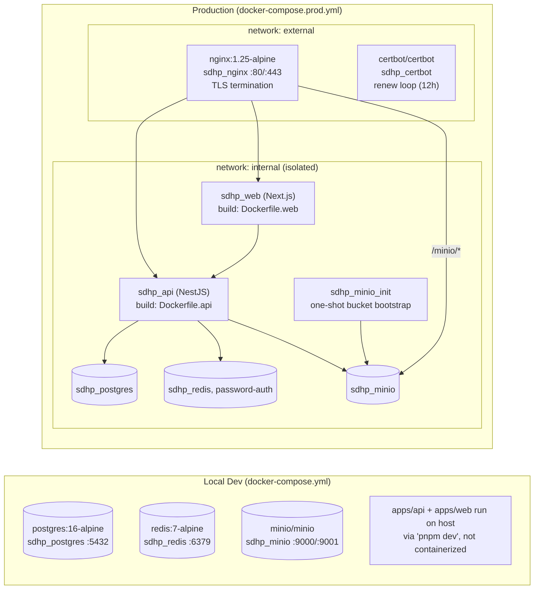

# Deployment

> Source: `docker/docker-compose.yml`, `docker/docker-compose.prod.yml`, `docker/Dockerfile.api`, `docker/Dockerfile.web`, `docker/nginx/`, `docker/certbot/`, `docker/scripts/`, `docker/DEPLOY.md`, root `package.json`/`turbo.json`/`pnpm-workspace.yaml`. Compiled from automated exploration in this session.

## 1. Monorepo / Build Tooling

- **Package manager:** pnpm `11.1.2` (`packageManager` pinned). Workspaces: `apps/*`, `packages/*` (`pnpm-workspace.yaml`), with `allowBuilds` for native binaries (`@nestjs/core`, `@prisma/client`, `@prisma/engines`, `@swc/core`, `bcrypt`, `prisma`, `unrs-resolver`).
- **Turborepo** (`turbo.json`): `build` depends on upstream `^build`, outputs `.next/**` (excl. cache) and `dist/**`; `dev` is uncached/persistent; `type-check` depends on `^build`.
- **Engines:** Node ≥20, pnpm ≥9 (compose images use Node 22).

## 2. Environments



### Dev stack (`docker-compose.yml`)
Only 3 infrastructure services run in Docker; `apps/api` and `apps/web` run directly on the host via `pnpm dev`.

| Service | Image | Container | Ports | Notes |
|---|---|---|---|---|
| postgres | postgres:16-alpine | sdhp_postgres | 5432:5432 | hardcoded creds postgres/postgres/sdhp; volume `postgres_data` |
| redis | redis:7-alpine | sdhp_redis | 6379:6379 | volume `redis_data` |
| minio | minio/minio:latest | sdhp_minio | 9000:9000 (API), 9001:9001 (console) | hardcoded creds minioadmin/minioadmin; volume `minio_data` |

### Production stack (`docker-compose.prod.yml`)
8 services across two Docker networks — `internal` (isolated, no host port exposure for db/cache/storage/app) and `external` (internet-facing, nginx + certbot only).

| Service | Container | Exposed ports | Depends on | Notes |
|---|---|---|---|---|
| postgres | sdhp_postgres | none | — | creds from `.env.production`, healthcheck `pg_isready` |
| redis | sdhp_redis | none | — | `--requirepass`, `--save 60 1`; **audited 2026-06-21: not consumed by any application code** — no client dependency in `apps/api/package.json`, only referenced in two comments about a deferred logout-revocation feature. See [Architecture Audit Report.md](Architecture%20Audit%20Report.md) §1. |
| minio | sdhp_minio | none | — | creds from `.env.production` |
| minio-init | sdhp_minio_init | none | minio (healthy) | one-shot: `mc mb --ignore-existing` to create the bucket, then exits |
| api | sdhp_api | none (internal+external networks) | postgres (healthy), redis (healthy), minio-init (completed) | runs `prisma migrate deploy` on every start (entrypoint script); healthcheck hits `/api/v1/auth/me` expecting an "Unauthorized" JSON body |
| web | sdhp_web | none (internal only) | api (healthy) | Next.js standalone server; healthcheck `wget 127.0.0.1:3000/` |
| nginx | sdhp_nginx | **80:80, 443:443** | api, web | only service with host-mapped ports; TLS via Let's Encrypt |
| certbot | sdhp_certbot | none (external network) | — | renewal loop, `certbot renew` every 12h |

**Volumes:** `postgres_data`, `redis_data`, `minio_data`, `nginx_logs` (prod only).

**API container env (from compose, values sourced from `.env.production`):** `NODE_ENV=production`, `DATABASE_URL`, `REDIS_URL`, `JWT_SECRET`, `JWT_EXPIRES_IN` (default 24h), `API_PORT=3001`, `FRONTEND_URL=https://<DOMAIN>`, `MINIO_ENDPOINT/PORT/ACCESS_KEY/SECRET_KEY/BUCKET` (bucket default `sdhp-files`), `MINIO_PUBLIC_ENDPOINT`. DNS hardcoded to `1.1.1.1, 8.8.8.8`.

**Web container env:** `NODE_ENV=production`, `HOSTNAME=0.0.0.0`, `PORT=3000`, `NEXT_PUBLIC_API_URL` (also baked in at **build time** as a Docker build-arg — i.e. changing it requires a rebuild, not just a restart).

## 3. Dockerfiles

### `Dockerfile.api` (Node 22 Alpine, 2 stages)
1. **builder** — corepack pnpm@11.1.2 → `pnpm install --frozen-lockfile --node-linker=hoisted` → copy `apps/api` + `packages/shared` → `pnpm prisma generate` → `pnpm build` (outputs `dist/`).
2. **runner** — installs `openssl`, `libc6-compat`, **`chromium`** (+ nss/freetype/harfbuzz/fonts incl. Arabic) for Puppeteer-based PDF generation (`CHROMIUM_EXECUTABLE_PATH=/usr/bin/chromium-browser`); non-root user `sdhp` (uid/gid 1001); copies built app + `node_modules`; copies `docker/scripts/docker-entrypoint.api.sh` → `apps/api/entrypoint.sh`; `EXPOSE 3001`; `ENTRYPOINT ["./entrypoint.sh"]`.

### `Dockerfile.web` (Node 22 Alpine, 3 stages)
1. **base** — corepack pnpm@11.1.2.
2. **builder** — installs deps, copies `apps/web` + `packages/`, bakes `NEXT_PUBLIC_API_URL` build-arg, `pnpm build`.
3. **runner** — non-root user `sdhp`; copies Next.js **standalone** output (`.next/standalone`, `.next/static`, `public/`); `EXPOSE 3000`; `CMD ["node", "apps/web/server.js"]`.

### API entrypoint (`docker/scripts/docker-entrypoint.api.sh`)
```sh
#!/bin/sh
set -e
prisma migrate deploy   # via /app/node_modules/.bin/prisma
exec node dist/src/main.js
```
**Every API container start applies pending Prisma migrations automatically** — there is no separate manual migration step in normal deploys.

## 4. Nginx

- **`docker/nginx/nginx.conf`** — base config: `worker_processes auto`, `server_tokens off`, `client_max_body_size 20m` (medical document uploads), gzip on, global security headers (`X-Frame-Options: SAMEORIGIN`, `X-Content-Type-Options: nosniff`, `X-XSS-Protection`, `Referrer-Policy: strict-origin-when-cross-origin`, restrictive `Permissions-Policy`). Two rate-limit zones: `api` (60 req/min/IP), `auth` (10 req/min/IP).
- **`docker/nginx/conf.d/sdhp.conf`** — domain-specific server blocks (`elajihealth.com`):
  - Port 80: serves ACME challenge path, redirects everything else to HTTPS (301).
  - Port 443: Let's Encrypt cert/key paths; **HSTS** (`max-age=63072000; includeSubDomains; preload`); `client_max_body_size 25m`; route map:
    - `= /api/v1/auth/login` → `limit_req zone=auth burst=5 nodelay` then proxy to `api:3001` (stricter login throttling)
    - `/api/` → proxy to `api:3001`, forwards `X-Real-IP`/`X-Forwarded-For`/`X-Forwarded-Proto`
    - `/minio/` → proxy to `minio:9000`, **Host header rewritten to `minio:9000`** (required for MinIO SigV4 signature validation), request buffering off
    - `/_next/static/` → proxy to `web:3000`, `Cache-Control: public, max-age=31536000, immutable`
    - `/` (fallback) → proxy to `web:3000`, WebSocket upgrade headers
- **`docker/nginx.local.http.conf`** — local-dev-only, HTTP-only single server block, port 80, `client_max_body_size 50m`, proxies `/api/` → `sdhp_api:3001` and `/` → `sdhp_web:3000`. Used for a local containerized stack distinct from the bare `pnpm dev` flow.

## 5. TLS / Certbot

`docker/certbot/` holds `conf/` (Let's Encrypt live certs, populated at runtime) and `www/` (ACME HTTP-01 challenge webroot) — empty until bootstrapped. Per `DEPLOY.md`:
1. First deploy: generate a self-signed placeholder cert so nginx can start and serve the ACME challenge on port 80.
2. Issue the real cert: `docker compose run --rm certbot certonly --webroot --webroot-path=/var/www/certbot --domain <DOMAIN>`.
3. Reload nginx: `docker exec sdhp_nginx nginx -s reload`.
4. Renewal: the `certbot` container loops `certbot renew` every 12h; an external cron job (recommended 03:15 daily) should reload nginx after renewal to pick up the new cert.

## 6. Backup / Restore Scripts (`docker/scripts/`)

| Script | Purpose |
|---|---|
| `docker-entrypoint.api.sh` | Migrations + API server start (see §3) |
| `backup.sh` | `pg_dump` (custom format, `-9` compression) to `/var/backups/sdhp/sdhp_<timestamp>.pgdump`; verifies integrity via `pg_restore --list`; prunes backups older than `RETENTION_DAYS` (default 30) |
| `backup-minio.sh` | `mc mirror` via `docker run --network container:sdhp_minio` to `/var/backups/sdhp/minio_<timestamp>/`; atomic `.tmp` → final rename on success; prunes old dirs |
| `restore.sh` | Drops + recreates the Postgres DB, restores from a `.pgdump` path argument via `pg_restore`; requires a typed `yes` confirmation — destructive |
| `restore-minio.sh` | `mc mirror --overwrite` from a backup dir argument; requires typed `yes`; warns to stop the API container first; does not delete bucket objects absent from the backup |
| `backup-offsite.sh` | **(Phase 156C, repo-only — see below)** `rclone copy` (never sync/delete) of `/var/backups/sdhp` to a Cloudflare R2 bucket, run via the throwaway `rclone/rclone` image; credentials only ever passed as container env vars, never written to a config file |

**Local backup cron — confirmed live and healthy (Phase 156A, verified directly against the production host, superseding the earlier "re-verify on the host" hedge):** `/etc/cron.d/sdhp-backup` exists and is active. PostgreSQL backup runs daily at 02:00, MinIO backup runs daily at 02:30. At verification time, the latest `.pgdump` passed `pg_restore --list` with exit code 0, retention showed no backups older than 30 days, and the local backup directory totaled 4.7M. (Historical MinIO credential errors appeared earlier in the logs, but the two most recent runs at verification time both succeeded — worth a periodic glance, not currently a blocker.)

**Offsite replication (Phase 156C) — exists repo-only, not yet installed in production:** `docker/scripts/backup-offsite.sh` and its full runbook (`docker/DEPLOY.md` §7.8 — required env vars, R2 credential scope, cron entry, verification/retrieval commands) are committed and ready to deploy, but no `.env.backup-offsite` file, R2 bucket, scoped credential, or cron entry exists on the production host yet. This is a **deliberate operator decision** to defer offsite setup until real/pilot clinic data exists, not an oversight — local backups (verified above) are the current sole recovery mechanism, and a single host/disk failure would still take backups down with the primary data until offsite is actually installed.

## 7. Deployment Runbook (`docker/DEPLOY.md`) — Section Map

| Section | Covers |
|---|---|
| Prerequisites | Docker ≥24, Compose v2, DNS A-record, ports 80/443 open, openssl |
| 1. Environment Setup | `.env.production` from example, generate random secrets, set `DOMAIN`/`NEXT_PUBLIC_API_URL` |
| 2. Build Docker Images | `docker compose build` |
| 3. TLS Bootstrap (first deploy only) | Placeholder cert → start core services → issue real cert → reload nginx |
| 4. Start All Services | `docker compose up -d`; startup ordering enforced by `depends_on` + healthchecks |
| 5. Post-Startup Checklist | Container health, bucket creation, smoke tests (`/`, `/api/docs` expect 404 in prod, `/api/v1/auth/me`, HSTS header), staging seed data |
| 6. Certificate Renewal | Auto-renewal verification, `--dry-run`, nginx reload cron |
| 7. Scheduled Backups | Env vars, cron file contents, manual smoke test, verification, retention policy, restore procedures |
| 8. Updating the Application | `git pull` → rebuild → `up -d` → post-update checklist |
| 9. Rollback | Checkout previous tag + rebuild; **note: if a migration was applied, rollback requires restoring the DB from backup** — code rollback alone is not sufficient once a migration has run |
| 10. Healthcheck Verification | `docker inspect` health status for all services |
| 11. Stopping / Removing | `down` (volumes preserved) vs `down -v` (**destructive** — removes volumes) |

## 8. Notable Production Hardening (confirmed via project memory + this pass)

- Swagger (`/api/docs`) is disabled (404) when `NODE_ENV=production` (`main.ts`).
- HSTS header active; auth endpoint rate-limited (`limit_req zone=auth burst=5 nodelay`).
- Migrations run automatically on every API container start (no manual step, but also no manual gate — a bad migration ships as soon as the container restarts).

## 9. TODO / Unknown

- Contents/role of `packages/shared` in the build — not inspected in this pass.
- Whether the historical MinIO credential errors noted in §6 recur — worth a periodic log check, not currently blocking.

~~Whether Redis is actually consumed by any API code path~~ — **resolved by audit, 2026-06-21**: confirmed not consumed. See [Architecture Audit Report.md](Architecture%20Audit%20Report.md) §1.

~~Current/live state of the cron schedule on the actual production host~~ — **resolved by direct verification, Phase 156A**: confirmed installed and healthy. See §6 above.
