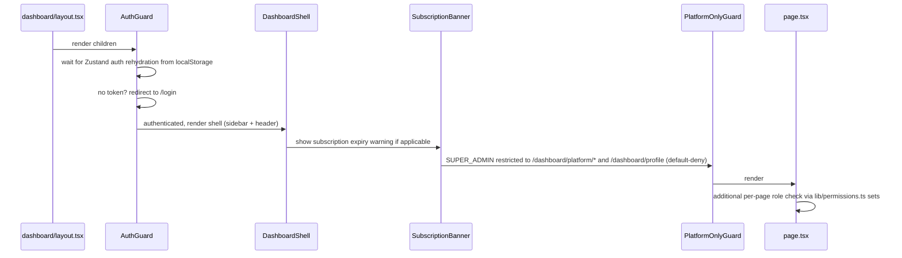

# Frontend Structure

> Source: `apps/web/src` — Next.js App Router, TypeScript, React Query, Zustand, next-intl. Compiled from automated exploration in this session; verify exact file paths before depending on them for refactors.

## 1. Routing Tree

Locale-prefixed App Router: `apps/web/src/app/[locale]/...`. Locales: `ar` (default, no prefix) and `en` (`/en/*` prefix) — `as-needed` strategy via `apps/web/src/i18n/routing.ts`.

```mermaid
flowchart TD
    Root["[locale]/layout.tsx\n(i18n, fonts, RTL/LTR, Providers)"]
    Root --> AuthGroup["(auth)/login/page.tsx"]
    Root --> Dashboard["dashboard/layout.tsx\nAuthGuard -> DashboardShell -> SubscriptionBanner -> PlatformOnlyGuard"]
    Root --> Print["(print)/...\nAuthGuard only, no DashboardShell"]

    Dashboard --> D1["dashboard/page.tsx — Overview"]
    Dashboard --> D2["dashboard/today/page.tsx — Today Hub"]
    Dashboard --> D3["dashboard/patients/..."]
    Dashboard --> D4["dashboard/appointments/..."]
    Dashboard --> D5["dashboard/queue/..."]
    Dashboard --> D6["dashboard/doctor/..."]
    Dashboard --> D7["dashboard/technician/..."]
    Dashboard --> D8["dashboard/follow-ups/, my-follow-ups/"]
    Dashboard --> D9["dashboard/invoices/, cashier/, reports/billing/"]
    Dashboard --> D10["dashboard/settings/..."]
    Dashboard --> D11["dashboard/hr/..."]
    Dashboard --> D12["dashboard/doctors/..."]
    Dashboard --> D13["dashboard/platform/... (SUPER_ADMIN only)"]
    Dashboard --> D14["dashboard/profile/page.tsx"]

    Print --> P1["(print)/encounter/[id]/print"]
    Print --> P2["(print)/invoice/[id]/print"]
    Print --> P3["(print)/subscription-payments/[organizationId]/[paymentId]/print"]
```

### Route inventory (under `/dashboard`)

| Area | Routes |
|---|---|
| Overview | `/dashboard`, `/dashboard/today` |
| Patients | `/dashboard/patients`, `/dashboard/patients/[id]`, `/dashboard/patients/pending-links` |
| Appointments | `/dashboard/appointments`, `/appointments/new`, `/appointments/[id]` |
| Queue | `/dashboard/queue`, `/queue/check-in` |
| Doctor workspace | `/dashboard/doctor`, `/doctor/queue`, `/doctor/encounter/[id]` |
| Technician | `/dashboard/technician/labs`, `/technician/radiology` |
| Follow-ups | `/dashboard/follow-ups` (org-wide), `/dashboard/my-follow-ups` (doctor's own) |
| Billing | `/dashboard/invoices`, `/invoices/new`, `/invoices/[id]`, `/dashboard/cashier`, `/dashboard/reports/billing` |
| Clinic config (Settings) | `/dashboard/settings/clinic`, `/settings/billing`, `/settings/services`, `/settings/departments`, `/settings/visit-types`, `/settings/employees`, `/settings/staff` |
| HR | `/dashboard/hr`, `/hr/employees`, `/hr/employees/[id]`, `/hr/attendance`, `/hr/leave`, `/hr/accounts` |
| Doctor management | `/dashboard/doctors`, `/doctors/[id]/schedule` |
| Platform (SUPER_ADMIN) | `/dashboard/platform/overview`, `/platform/organizations`, `/organizations/new`, `/organizations/[id]`, `/platform/payments`, `/platform/users`, `/platform/audit-logs` |
| Profile | `/dashboard/profile` (all roles) |
| Auth | `/(auth)/login` |
| Print (URL-invisible route group, no nav) | `/encounter/[id]/print`, `/invoice/[id]/print`, `/subscription-payments/[organizationId]/[paymentId]/print` |

**Phase 150B-3A:** five dashboard detail/action pages (`doctor/encounter/[id]`, `invoices/[id]`, `appointments/[id]`, and two others) were reachable by direct URL with no page-level role check — sidebar hiding doesn't stop direct navigation, and the backend 401/403 arrives only after the page has already rendered. All five now have the same inline guard pattern already used elsewhere, reusing existing role-constant sets rather than inventing new ones.

Note: `/dashboard/settings/employees` and `/dashboard/settings/staff` are both confirmed **client-redirect stubs** (verified by reading both `page.tsx` files) — they exist only to keep old bookmarks working. `employees` redirects to `/dashboard/hr/employees` (moved in Phase 145C) and `staff` redirects to `/dashboard/hr/accounts` (moved in Phase 146D-146G). HR (`/dashboard/hr/*`) is the current home for both employee profiles and login accounts.

## 2. Layout & Guard Chain (protected routes)

Key files:
- `apps/web/src/app/[locale]/layout.tsx` — i18n setup, RTL/LTR `dir` attribute, fonts (Inter + Noto Sans Arabic), `NextIntlClientProvider`, `Providers` (Zustand).
- `apps/web/src/app/[locale]/dashboard/layout.tsx` — wraps all dashboard routes with the guard chain above.
- `apps/web/src/components/layout/auth-guard.tsx` — redirects unauthenticated users to `/login`.
- `apps/web/src/components/layout/dashboard-shell.tsx` — sidebar + header chrome, responsive (desktop sidebar always visible at `lg+`, mobile drawer).
- `apps/web/src/components/layout/platform-only-guard.tsx` — default-deny allowlist (`SUPER_ADMIN_ALLOWED_PATH_PREFIXES`) confining SUPER_ADMIN to platform routes.
- `apps/web/src/components/layout/role-guard.tsx` — generic per-page role redirect wrapper.
- `apps/web/src/components/layout/sidebar.tsx` — role-filtered nav items (`navItem.roles.includes(user.role)`).

## 3. Component Directory Overview

| Directory | Representative components | Purpose |
|---|---|---|
| `components/patients/` | `patient-form`, `patient-header`, `patient-outstanding-balance`, `clinical-reports-tab`, `lab-orders-tab`, `radiology-orders-tab`, `invoices-tab`, `patient-follow-ups-tab`, `duplicate-warning` | Patient CRUD + profile timeline tabs |
| `components/appointments/` | `appointment-form`, `appointment-list`, `appointment-status-badge`, `available-slots-picker`, `cancel-appointment-dialog`, `no-show-button` | Booking + lifecycle actions |
| `components/queue/` | `queue-board`, `queue-ticket`, `check-in-button`, `advance-queue-button`, `walk-in-wizard` | Check-in/queue operations |
| `components/encounters/` | `encounter-workspace`, `vitals-form`, `icd-code-combobox`, `prescription-panel`, `clinical-report-panel`, `lab-order-panel`, `radiology-order-panel`, `follow-up-booking-panel`, `end-encounter-button` | Doctor clinical workspace |
| `components/doctor/` | `doctor-queue-panel`, `start-encounter-button` | Doctor-scoped queue/encounter entry |
| `components/doctors/` | `doctors-list`, `doctor-schedule-grid`, `add-exception-form` | Doctor admin + schedule management |
| `components/technician/` | `lab-worklist-panel`, `radiology-worklist-panel` | Technician order worklists |
| `components/billing/` | `invoice-list`, `invoice-detail`, `create-invoice-form`, `cashier-view`, `record-payment-form`, `invoice-status-badge`, `service-picker` | Invoicing + payments |
| `components/follow-ups/` | `follow-up-list`, `doctor-follow-up-list`, `follow-up-status-badge` | Org vs. doctor-scoped follow-up lists |
| `components/hr/` | `employee-profile-detail`, `attendance-table` | HR profile + attendance UI |
| `components/settings/` | `clinic-settings-form`, `working-days-grid`, `billing-policy-form`, `departments-table`, `services-table`, `visit-types-table`, `employee-profiles-table`, `staff-table` | Clinic configuration screens |
| `components/platform/` | `platform-users-table`, `organization-accounts-section` | SUPER_ADMIN platform operations |
| `components/layout/` | `auth-guard`, `dashboard-shell`, `header`, `sidebar`, `role-guard`, `platform-only-guard`, `subscription-banner` | Shell, navigation, guards |
| `components/ui/` | `badge`, `tabs`, `skeleton`, `toast` | Shadcn/ui-style primitives |
| `components/shared/` | (empty at time of inspection) | Reusable utilities live in `lib/` instead |

## 4. API Client & Data-Fetching Pattern

`apps/web/src/lib/api.ts`:
- Base URL: `process.env.NEXT_PUBLIC_API_URL ?? 'http://localhost:3001/api'`.
- Methods: `api.get/post/put/patch/delete/blob` (blob for binary downloads — PDFs).
- Auth: Bearer token read from the Zustand auth store; redirects to login on 401/403.
- `ApiError` class preserves backend `code`/`statusCode`; a distinct path handles 409 conflicts.

Hooks (`apps/web/src/hooks/use-*.ts`, ~32 files) wrap React Query per domain: patients, appointments, billing/invoices, queue, encounters/clinical-reports/prescriptions, labs/radiology, follow-ups, HR (employees/staff/attendance/leave/documents), clinic config (settings/departments/doctor-schedules), dashboards (overview/today-hub), platform (organizations/subscription-payments/audit-logs), plus shared utilities (branches, doctors, toast).

## 5. Global State

`apps/web/src/store/`:
- `auth.ts` — Zustand store, persisted to `localStorage` under key `sdhp-auth`. Holds `token` (JWT) and `user` (`id`, `phone`, `email`, `firstName`, `lastName`, `role`, `organizationId`, `branchId`). Exposes `login()`/`logout()`.
- `unsaved-guard.ts` — prevents navigation away from dirty forms.

## 6. Internationalization (i18n)

- `apps/web/src/i18n/routing.ts` — locales `['ar', 'en']`, default `ar`, prefix strategy `as-needed`.
- `apps/web/src/messages/en.json` / `ar.json` — full bilingual coverage of UI strings.
- `dir={locale === 'ar' ? 'rtl' : 'ltr'}` set at the root `<html>` level.
- Fonts: Inter (Latin) + Noto Sans Arabic.
- Pattern in components: `useTranslations(namespace)`, `useLocale()`.
- **Mixed-direction clinical text:** when a UI element pairs an Arabic label with a free-text clinical value that may be in either language, never apply `dir="auto"` to a single element containing both — keep label and value as separate elements, and scope `dir="auto"` to the value only. Applying it to the combined element lets the label's script skew the bidi algorithm's inference for the whole block.
- **Multi-part joined detail strings** (e.g. dosage/frequency/duration joined with a separator): don't force the entire joined string into one `dir` (such as a blanket `dir="ltr"`) — each part may have its own independent direction, and forcing the whole string reorders parts unpredictably. Instead, render each part in its own bidi-isolated element (`<bdi>`), with the separator placed as literal markup between elements rather than baked into a pre-joined string.

## 7. Permissions on the Frontend

Full detail in [Permissions Matrix.md](Permissions%20Matrix.md). Summary: `apps/web/src/lib/permissions.ts` defines array-based `NAV_*_ROLES` (sidebar visibility, `.includes(role)`) and Set-based `*_ROLES`/`*_ACCESS_ROLES` (page/action gating, `.has(role)`). This is a UX layer, not the security boundary — actual enforcement is the backend `RolesGuard` (see [Permissions Matrix.md](Permissions%20Matrix.md) §1).

## 8. TODO / Unknown

- `components/shared/` was empty at inspection time — confirm nothing was missed or recently added.
- Exact contents of `packages/shared` and whether the frontend imports types from it directly — not inspected in this pass.
