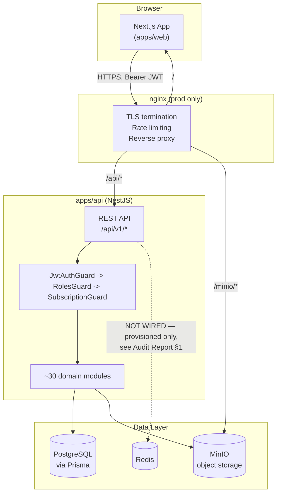
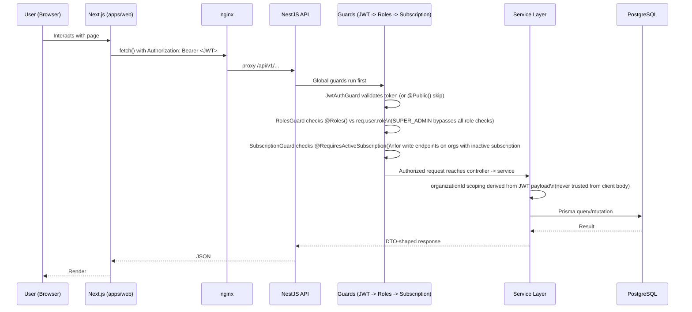
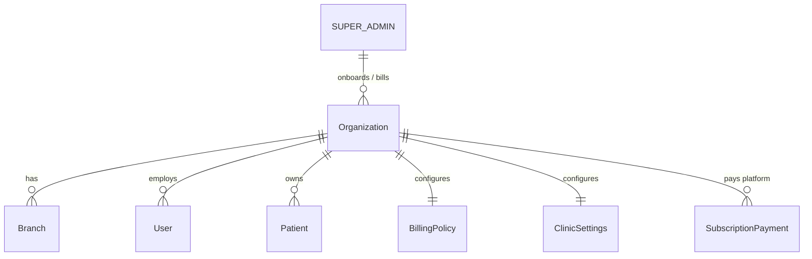
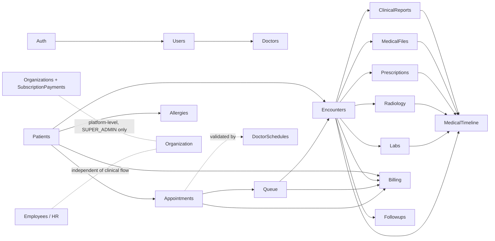

# System Architecture

> Documents the **actual current implementation** of SDHP as of 2026-06-21 (commit `13890c4`, Phase 147G). This is not an aspirational design — anything marked `TODO/Unknown` means the investigating agent could not confirm it from code in the time available, not that the feature doesn't exist. Verify against code before relying on specifics.

## 1. Overview

SDHP is a multi-tenant SaaS clinic/hospital management platform. A single deployment serves many independent clinics ("Organizations"); each Organization's data is isolated by `organizationId` scoping at the service layer. One additional tier — **SUPER_ADMIN** — operates above all tenants as the platform owner (onboarding clinics, billing them for the SaaS subscription, viewing global audit logs).

**Monorepo layout** (pnpm + Turborepo):

```
apps/api        NestJS REST API (TypeScript, Prisma ORM, PostgreSQL)
apps/web        Next.js 14+ App Router frontend (TypeScript, React Query, Zustand, next-intl)
packages/shared TODO/Unknown — shared types/utilities referenced by pnpm-workspace.yaml; contents not inspected in this pass
docker/         Dockerfiles, docker-compose (dev + prod), nginx, certbot, backup scripts
```

## 2. High-Level Component Diagram



**Audited 2026-06-21 (see [Architecture Audit Report.md](Architecture%20Audit%20Report.md) §1) — Redis is provisioned but not consumed by any application code.** Confirmed by: no `redis`/`ioredis`/`@nestjs/redis`/`cache-manager` dependency in `apps/api/package.json`; the only two source-code references to "Redis" anywhere in `apps/api/src` are code comments in `auth.service.ts:77` and `auth.controller.ts:55` stating that server-side token revocation on logout "is deferred — requires Redis denylist integration" (matches project memory's "Phase 136D — not yet implemented"). The container runs in both compose files purely as infrastructure-in-waiting for that future feature.

## 3. Request Flow (Authenticated Request)



Key points (confirmed by code inspection):
- Auth uses **JWT via Passport**, login is by **phone number, not email**.
- `JwtAuthGuard` and `RolesGuard` are registered as **global `APP_GUARD`s** in `app.module.ts` — every endpoint is protected unless explicitly marked `@Public()`.
- `RolesGuard`: if a controller method has no `@Roles()` decorator, it is open to **any authenticated user**. If `@Roles()` is present, `SUPER_ADMIN` always passes regardless of the listed roles (`roles.guard.ts`, confirmed bypass at the top of the check).
- `SubscriptionGuard` (`common/subscription/`) gates **write** operations (create/update) on clinical and billing modules behind `@RequiresActiveSubscription()` — if an Organization's `subscriptionStatus` is not active, those writes are blocked. HR (`employees`) and medical-files are deliberately exempt.
- Tenant isolation is enforced **in the service layer, not controllers** — `organizationId` is derived server-side from the JWT payload (`user.organizationId`), never trusted from request bodies. A shared helper, `assertPatientLinkedToOrg` (`common/helpers/`), is used across patient-adjacent modules to confirm the patient belongs to the caller's org before allowing access.

## 4. Multi-Tenancy Model



- `Organization` is the tenant root. Every clinical/financial/HR record carries (directly or via a parent) an `organizationId`.
- `SubscriptionPayment` is the **platform's own SaaS billing** of the Organization — explicitly modeled as separate from `Invoice`/`Payment` (clinic-to-patient billing), per a code comment in `schema.prisma`. SUPER_ADMIN-only.
- `Branch` is an optional sub-unit of an Organization (used by Users, Departments, Appointments, Invoices, EmployeeProfiles).

## 5. Core Domain Modules and How They Connect



Full per-module endpoint and dependency detail is in [Modules.md](Modules.md) and [API Map.md](API%20Map.md). Database entities and relations are in [Database Schema.md](Database%20Schema.md). Role/permission detail is in [Permissions Matrix.md](Permissions%20Matrix.md). Frontend route/component structure is in [Frontend Structure.md](Frontend%20Structure.md). Docker/runbook detail is in [Deployment.md](Deployment.md).

### Clinical workflow narrative (as implemented)

1. **Appointments** are booked against a **Doctor**, validated against **DoctorSchedules** (working hours + exceptions) — `appointments` module imports `doctor-schedules`.
2. Patient checks in → **Queue** entry created (`appointmentId` unique 1:1), ticket number assigned per business-day (`businessDate` string, Asia/Damascus). Appointment status moves `SCHEDULED → ... → IN_QUEUE`.
3. Doctor starts visit → **Encounter** created (idempotent — re-opening an in-progress visit returns the existing encounter rather than duplicating it). Appointment → `IN_PROGRESS`, Queue → `IN_PROGRESS`.
4. From the encounter, a doctor can create **Prescriptions**, order **Labs**/**Radiology**, attach **MedicalFiles**, write a **ClinicalReport**, and schedule a **Followup**.
5. **Billing**: an `Invoice` is auto-created on check-in/queue transitions when `BillingPolicy.autoCreateInvoiceOnCheckin` is true (org-configurable), or manually from the encounter/appointment. Invoice lifecycle: `DRAFT → ISSUED → PARTIALLY_PAID → PAID` (or `CANCELLED`).
6. Every clinically-significant action additionally writes a **MedicalTimelineEvent** (read-only aggregated patient history) and, separately, many mutating actions write an **AuditLog** entry (immutable, SUPER_ADMIN-readable only).
7. **HR** (Employees, Attendance, Leave) is a parallel, largely independent subsystem: `EmployeeProfile` is deliberately decoupled from `User` (HR-only staff need no login; some `User`s like SUPER_ADMIN have no `EmployeeProfile`). HR writes are **not** gated by `SubscriptionGuard` (administrative, not clinical revenue).
8. **Super Admin / Platform**: `Organizations`, `SubscriptionPayments`, and `AuditLogs` (global) are SUPER_ADMIN-only concerns for operating the SaaS platform itself, separate from any single clinic's operations. On the frontend, a `PlatformOnlyGuard` restricts SUPER_ADMIN to `/dashboard/platform/*` and `/dashboard/profile` only — they cannot use clinic-operational pages by default.

### Modules present but not yet implemented (confirmed stubs — audited 2026-06-21)

`notifications`, `ai-assistant`, `staff`, `rooms`, and `staff-scheduling` each contain **only a `.gitkeep` file** — verified directly by listing each folder's contents (`apps/api/src/modules/{notifications,ai-assistant,staff,rooms,staff-scheduling}/`). No controllers, services, or modules exist in any of them; none are registered in `app.module.ts`. These are reserved folder names with zero implementation, not partially-built features. Staff scheduling functionality (attendance + leave tracking) lives entirely inside `EmployeesModule` instead. See [Architecture Audit Report.md](Architecture%20Audit%20Report.md) §2-5.

## 6. Cross-Cutting Infrastructure Modules

| Module | Role |
|---|---|
| `AuditLogsModule` | Exports `AuditLogsWriterService`, injected by domain modules to write immutable audit rows. Read API is SUPER_ADMIN only. |
| `MedicalTimelineModule` | Exports `MedicalTimelineWriterService`; passive read-only aggregated event log per patient. |
| `StorageModule` | Abstracts MinIO presigned-URL file storage; used by `medical-files`, `clinical-reports`, `employees` (documents). |
| `PdfModule` | Puppeteer/Chromium-based PDF rendering; used by `billing` (invoice PDF) and `clinical-reports`/`reports`. |
| `common/subscription` (`SubscriptionAccessModule`) | `@RequiresActiveSubscription()` guard blocking writes for orgs with inactive SaaS subscription. |
| `common/guards` | `JwtAuthGuard`, `RolesGuard` — both global `APP_GUARD`s. |

## 7. Frontend Architecture Summary

Next.js App Router under a `[locale]` segment (`ar` default, `en` via `/en/*` prefix — `as-needed` strategy). Protected app under `/dashboard` is wrapped by a layered guard chain: `AuthGuard` → `DashboardShell` (sidebar/header) → `SubscriptionBanner` → `PlatformOnlyGuard`, plus page-level role checks reading from `lib/permissions.ts`. State: Zustand for auth (`token`, `user`, persisted to `localStorage`), React Query (via per-domain `use-*.ts` hooks) for server data. Full detail in [Frontend Structure.md](Frontend%20Structure.md).

## 8. Deployment Architecture Summary

Dev: only `postgres`, `redis`, `minio` run in Docker; `apps/api` and `apps/web` run via `pnpm dev` directly on the host. Prod (`docker-compose.prod.yml`): 8 services — `postgres`, `redis`, `minio`, `minio-init` (bucket bootstrap), `api`, `web`, `nginx` (only internet-facing service, TLS via Let's Encrypt/certbot), `certbot` (renewal loop). Two Docker networks (`internal`, `external`) isolate the database tier from the internet. **Phase 149B:** prod is pinned to its own explicit Compose project name (`sdhp_prod`) and its three data volumes are pinned by exact name — fixing a real incident where dev and prod, both defaulting to the same derived project name and identical container names, caused dev's `docker compose up` to silently replace prod's live containers. Full detail in [Deployment.md](Deployment.md).

## 9. Known Architectural Notes / TODOs

- Redis is provisioned but its application-level usage is **TODO/Unknown** — likely earmarked for the planned JWT denylist (logout revocation), not yet wired per project memory.
- `packages/shared` contents were not inspected in this documentation pass — **TODO/Unknown** what's shared between `apps/api` and `apps/web` (likely TypeScript types).
- AI Assistant module (`apps/api/src/modules/ai-assistant/`) exists as a folder name only — **TODO/Unknown** scope/intent, not implemented as of this pass.
- BRANCH_ADMIN role exists in the `UserRole` enum and is confirmed (direct grep) in exactly 5 backend controllers: `followups` (full access), and read-only access on `clinic-settings`, `doctor-schedules`, `services`, `visit-types`. It has no confirmed access to patients, appointments, encounters, billing, or queue — a real but narrow role today, not yet a fully-built branch-management tier. See [Permissions Matrix.md](Permissions%20Matrix.md).
